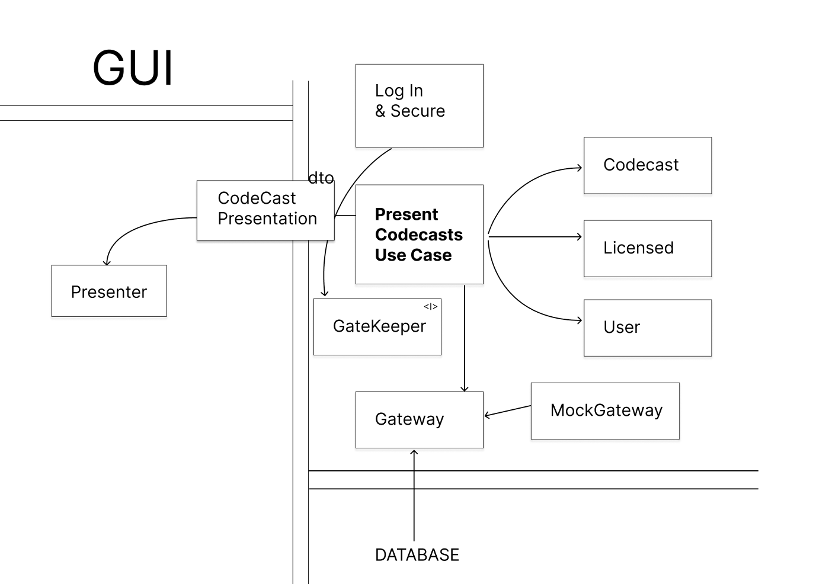

# CleanCodersCom website

This repository is a C# implementation of the project demonstrated in the Clean Coders course by **Robert C. Martin (Uncle Bob)** and **Micah Martin**. The project serves as an educational exercise to practice and apply **Clean Code principles**, **Test-Driven Development (TDD)**, and **Acceptance Testing** using **FitNesse**.

### Prerequisites
- [.NET SDK](https://dotnet.microsoft.com/download) (version 6.0 or newer).
- [FitNesse](http://fitnesse.org/) installed and configured.
- A development environment like [JetBrains Rider](https://www.jetbrains.com/rider/) or [Visual Studio](https://visualstudio.microsoft.com/).

## Objectives
- Implement the Clean Coders website functionality in **C#**, following **Clean Architecture** principles.
- Demonstrate practical use of:
  - **SOLID Principles**
  - **Test-Driven Development (TDD)** for unit tests.
  - **Acceptance Testing** with **FitNesse**.
  - Modular, maintainable, and extensible design.
- Highlight differences in approach and implementation when translating from **Java** to **C#**.

## Folder Structure
```
CleanCodersCom/
 src/
    Fixtures/
 tests/
```
## Architecture
We started by defining boundaries for the "Present Codecasts" use case. This involves identifying the use case itself and entities such as Codecast and User.

The role of the MockGateway is to delay decisions regarding the database implementation while adhering to the principles of Clean Architecture. By deferring these decisions, we ensure that the core application logic remains independent of infrastructure details.

As illustrated in the image below, boundaries are crossed only from outer layers towards inner layers, but never the other way around. This ensures strict adherence to dependency inversion and promotes maintainability.



### Installation
1. Clone the repository:
   ```bash
   git clone https://github.com/lapec/cleancoders.git
   cd cleancoders

2. Run FitNesse tests

## Contributing

Pull requests are welcome. For major changes, please open an issue first
to discuss what you would like to change.

Please make sure to update tests as appropriate.

## License

[MIT](https://choosealicense.com/licenses/mit/)
